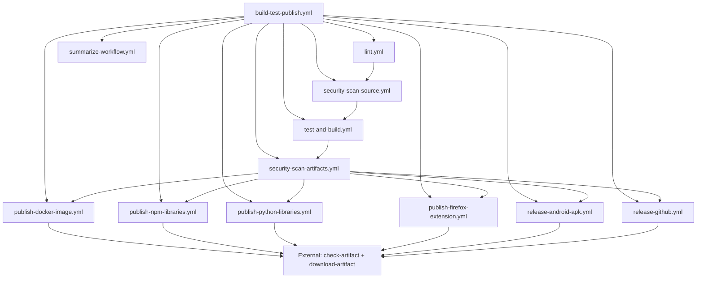

# GitHub Actions Workflows Documentation

This repository contains a comprehensive set of reusable GitHub Actions workflows for building, testing, and publishing various types of applications and libraries.

## 🚀 Quick Start

To use these workflows in your project, create a workflow file in your repository's `.github/workflows/` directory:

```yaml
name: CI/CD Pipeline

on:
  push:
    branches: [ main, develop ]
  pull_request:
    branches: [ main ]

jobs:
  build_and_deploy:
    uses: tehw0lf/workflows/.github/workflows/build-test-publish.yml@main
    permissions:
      actions: write        # Required for workflow management
      contents: write       # Required for GitHub releases
      packages: write       # Required for Docker/GHCR publishing
      security-events: write # Required for security scanning (SARIF uploads)
      id-token: write       # REQUIRED - Always needed (currently for npm Trusted Publishing, planned for future OIDC integrations)
    with:
      tool: npm
      lint: "run lint"
      test: "run test"
      build_main: "run build"
      artifact_path: "dist"
      event_name: ${{ github.event_name }}
      docker_meta: '[{"name":"my-app","file":"Dockerfile"}]'
      libraries: "lib1,lib2"
      library_path: "packages"
    secrets: inherit
```

**Important permissions:**
- **`id-token: write` is REQUIRED for all workflows** - Currently used for npm, Python, and Rust Trusted Publishing (no NPM_TOKEN, UV_TOKEN, or CARGO_REGISTRY_TOKEN needed!), with plans to extend OIDC to other publishing workflows in the future
- **`security-events: write` is REQUIRED** - Enables SARIF uploads to GitHub Security tab for centralized vulnerability tracking
- Due to GitHub Actions limitations, these permissions must be set at the top-level calling workflow, regardless of which publishing workflows you use
- If using `release-it` for npm, add `.release-it.json` with `{"npm": {"skipChecks": true}}`

## 📋 Available Workflows

### 1. Universal Workflow (`build-test-publish.yml`)

The main orchestrator workflow that handles the complete CI/CD pipeline.

**Key Features:**
- ✅ Multi-language support (Node.js, Python, Rust, Java, Gradle, Bash)
- ✅ **Dual-layer security scanning** (pre-build source + post-build artifacts)
- ✅ Automated testing and building
- ✅ Multi-platform publishing (Docker, npm, PyPI, crates.io, Firefox, Android)
- ✅ Conditional deployment based on branch and inputs

**Required Inputs:**
- `event_name`: GitHub event name (required)

**Optional Inputs:**
- `tool`: Build tool (npm, yarn, uv, cargo, ./gradlew, mvn, bash)
- `lint`: Linting command
- `test`: Test command
- `build_main`: Build command for main branch
- `artifact_path`: Path to build artifacts
- `docker_meta`: Docker metadata JSON
- `libraries`: Comma-separated list of libraries to publish
- `rust_version`: Rust toolchain version (default: "stable")
- `enable_clippy`: Run Clippy linting for Rust (default: true)
- `enable_rustfmt`: Run Rustfmt checks for Rust (default: true)
- `clippy_args`: Additional Clippy arguments (default: "-- -D warnings")
- `cargo_features`: Cargo features to enable (e.g., "async,network")
- `enable_security_scanning`: Enable/disable security scanning (default: "true")
- `semgrep_rules`: Semgrep ruleset configuration (default: "auto")
- `trivy_severity`: Minimum severity threshold (default: "MEDIUM,HIGH,CRITICAL")
- `trivy_exit_code`: Fail build on vulnerabilities (default: "1")
- And many more...

### 2. Test and Build (`test-and-build.yml`)

Core workflow for testing and building applications.

**Features:**
- ✅ Advanced dependency caching for faster builds (tool-specific cache keys)
- ✅ Multi-language toolchain setup
- ✅ Nx monorepo support
- ✅ Playwright E2E testing (supports .ts, .js, and .mjs config variants)
- ✅ Descriptive artifact upload suffixes for clarity
- ✅ Configurable timeouts (45 minutes)

### 3. Docker Publishing (`publish-docker-image.yml`)

Publishes Docker images to container registries.

**Features:**
- ✅ Multi-platform builds (linux/amd64, linux/arm64)
- ✅ Flexible registry support (GHCR, Docker Hub, private registries)
- ✅ Input validation for security
- ✅ Matrix builds for multiple images with fail-fast: false
- ✅ Timeout protection (30 minutes)

### 4. NPM Libraries (`publish-npm-libraries.yml`)

Publishes Node.js libraries to npm registry using **Trusted Publishing** (Provenance).

**Features:**
- ✅ **Trusted Publishing**: No NPM_TOKEN required - uses OpenID Connect (OIDC)
- ✅ Version comparison to prevent duplicate publishes
- ✅ Multi-library support
- ✅ Security: Input sanitization and validation
- ✅ Dry-run validation (catches errors before publish)
- ✅ Timeout protection (20 minutes)

**Important:** Requires `id-token: write` permission instead of NPM_TOKEN secret

### 5. Python Libraries (`publish-python-libraries.yml`)

Publishes Python packages to PyPI using `uv` and **Trusted Publishing** (Provenance).

**Features:**
- ✅ **Trusted Publishing**: No UV_TOKEN required - uses OpenID Connect (OIDC)
- ✅ UV package manager support
- ✅ Automatic dependency management
- ✅ Explicit artifact validation with clear error messages
- ✅ Timeout protection (15 minutes)

**Important:** Requires `id-token: write` permission instead of UV_TOKEN secret

### 6. Rust/Cargo Crates (`publish-crates-io.yml`)

Publishes Rust crates to crates.io using **OIDC Trusted Publishing** (RFC 3691).

**Features:**
- ✅ **OIDC Trusted Publishing**: No CARGO_REGISTRY_TOKEN required - uses OpenID Connect
- ✅ Uses `rust-lang/crates-io-auth-action@v1` for authentication
- ✅ Short-lived tokens (auto-revoked after workflow completion)
- ✅ Version deduplication via crates.io API
- ✅ Dry-run support for testing
- ✅ Configurable Rustfmt and Clippy with custom arguments
- ✅ Cargo dependency caching (registry, git, target)
- ✅ Feature flag support (optional cargo features)
- ✅ Timeout protection (15 minutes)

**Important:** Requires `id-token: write` permission and Trusted Publisher configuration on crates.io

**Configuration:**
```yaml
with:
  tool: cargo
  rust_version: stable               # Toolchain version
  enable_rustfmt: true               # Run rustfmt checks
  enable_clippy: true                # Run clippy linting
  clippy_args: "-- -D warnings"      # Clippy arguments
  cargo_features: "async,network"    # Optional features
```

### 7. Firefox Extension (`publish-firefox-extension.yml`)

Publishes Firefox browser extensions to Mozilla Add-ons.

**Features:**
- ✅ Automated packaging (XPI creation)
- ✅ AMO (addons.mozilla.org) publishing
- ✅ Timeout protection (15 minutes)

### 7. Android APK (`release-android-apk.yml`)

Builds and releases Android APK files.

**Features:**
- ✅ Automated keystore generation and caching
- ✅ APK signing and alignment
- ✅ GitHub releases integration
- ✅ Timeout protection (30 minutes)

### 8. GitHub Releases (`release-github.yml`)

Creates GitHub releases with artifacts.

**Features:**
- ✅ Automatic version detection (Python projects)
- ✅ Configurable release tags
- ✅ Artifact attachment
- ✅ Timeout protection (10 minutes)

### 9. Workflow Summary (`summarize-workflow.yml`)

Aggregates and reports results from all publishing workflows.

**Features:**
- ✅ Comprehensive status tracking across all workflows
- ✅ Visual summary table with status indicators
- ✅ Published artifacts tracking and output
- ✅ Refactored from 90 lines to 30 lines (67% reduction) using helper functions
- ✅ Quick timeout (5 minutes)

### 10. Security Scan Source (`security-scan-source.yml`)

**Pre-build security layer** that scans source code and dependencies before building.

**Features:**
- ✅ **Semgrep SAST**: Fast static analysis for all languages (configurable rulesets)
- ✅ **Bandit**: Python-specific source code security analysis
- ✅ **pip-audit**: Python dependency vulnerability scanning (official PyPA tool)
- ✅ **npm/yarn audit**: Node.js dependency vulnerability scanning
- ✅ **SARIF uploads**: Results appear in GitHub Security tab
- ✅ **Fail-fast**: Prevents building vulnerable code
- ✅ Timeout protection (15 minutes)

**Configuration:**
```yaml
with:
  enable_security_scanning: "true"  # Enable/disable (default: enabled)
  semgrep_rules: "auto"              # auto, p/security-audit, p/owasp-top-ten, p/ci
```

**All tools are 100% free and open source:**
- ✅ No signup required, no usage limits
- ✅ Industry-standard tools used by major projects
- ✅ Active maintenance and community support

### 11. Security Scan Artifacts (`security-scan-artifacts.yml`)

**Post-build security layer** that scans build artifacts before publishing.

**Features:**
- ✅ **Trivy**: Comprehensive scanner for containers, packages, filesystems
- ✅ **Grype**: Alternative vulnerability scanner for redundancy
- ✅ **Docker image scanning**: When `docker_meta` is provided
- ✅ **Filesystem scanning**: Scans artifacts from `artifact_path`
- ✅ **Security summary tables**: Visual vulnerability reports in workflow output
- ✅ **Final security gate**: Blocks publishing of vulnerable artifacts
- ✅ Timeout protection (20 minutes)

**Configuration:**
```yaml
with:
  trivy_severity: "MEDIUM,HIGH,CRITICAL"  # Severity threshold
  trivy_exit_code: "1"                     # 0=warn only, 1=fail build
```

**Defense-in-depth architecture:**
1. **Pre-build** (security-scan-source.yml): Scan code & dependencies → Prevent vulnerable builds
2. **Build** (test-and-build.yml): Create artifacts
3. **Post-build** (security-scan-artifacts.yml): Scan artifacts → Block vulnerable publishes
4. **Publish**: Only if both security layers pass ✅

## 🔧 Setup Instructions

### 1. Required Secrets & Permissions

#### Required Permissions (ALL WORKFLOWS)

**IMPORTANT:** The `id-token: write` permission is **REQUIRED for all workflows**, regardless of which publishing targets you use:

```yaml
jobs:
  build_and_deploy:
    uses: tehw0lf/workflows/.github/workflows/build-test-publish.yml@main
    permissions:
      id-token: write       # REQUIRED - Always needed for OIDC (npm/Python Trusted Publishing + future integrations)
      actions: write        # Required for workflow management
      contents: write       # Required for GitHub releases
      packages: write       # Required for Docker/GHCR publishing
      security-events: write # REQUIRED - For security scanning SARIF uploads
    with:
      tool: npm
      # ... other inputs
```

**Why are these permissions always required?**

**`id-token: write`:**
- Currently used for npm, Python, and Rust Trusted Publishing (no NPM_TOKEN, UV_TOKEN, or CARGO_REGISTRY_TOKEN needed!)
- Planned for future OIDC integrations with other publishing targets (Docker registries, etc.)
- Due to GitHub Actions limitations, permissions cannot be conditionally granted in reusable workflows
- Must be set at the top-level calling workflow, even if you're not publishing to npm, PyPI, or crates.io

**`security-events: write`:**
- Required for uploading SARIF reports to GitHub Security tab
- Enables centralized security vulnerability tracking across repositories
- Provides detailed security findings for Semgrep, Bandit, Trivy, and Grype scans
- Cannot be conditionally granted in reusable workflows

#### Required Secrets

Add these secrets to your repository settings based on your publishing targets:

```yaml
# For Docker publishing
GITHUB_TOKEN: # Auto-provided by GitHub

# For npm publishing - NO NPM_TOKEN NEEDED!
# Uses Trusted Publishing (Provenance) with OIDC
# Requires: id-token: write permission (see above)

# For Python publishing - NO UV_TOKEN NEEDED!
# Uses Trusted Publishing (Provenance) with OIDC
# Requires: id-token: write permission (see above)

# For Rust/Cargo publishing - NO CARGO_REGISTRY_TOKEN NEEDED!
# Uses OIDC Trusted Publishing (RFC 3691)
# Requires: id-token: write permission (see above)

# For Firefox extensions
AMO_API_KEY: # Mozilla Add-ons API key
AMO_API_SECRET: # Mozilla Add-ons API secret

# For Android builds
ANDROID_STOREPASS: # Android keystore password

# For Nx Cloud (optional)
NX_CLOUD_ACCESS_TOKEN: # Nx Cloud access token
```

### 2. Release-it Configuration for npm Publishing

When using `release-it` with Trusted Publishing, you need to configure it to skip npm's built-in checks since the workflow handles authentication via OIDC.

Create a `.release-it.json` file in your project root:

```json
{
  "npm": {
    "skipChecks": true
  }
}
```

**Why is this needed?**
- Release-it normally checks for npm authentication before publishing
- With Trusted Publishing, authentication happens automatically via GitHub's OIDC token
- `skipChecks: true` tells release-it to trust the workflow's authentication

### 3. Project Structure Examples

#### Node.js Project with npm Publishing
```
project/
├── package.json
├── .release-it.json     # Required for release-it + Trusted Publishing
├── src/
├── dist/
├── Dockerfile (optional)
└── .github/workflows/ci.yml
```

#### Node.js Project (without release-it)
```
project/
├── package.json
├── src/
├── dist/
├── Dockerfile (optional)
└── .github/workflows/ci.yml
```

#### Python Project
```
project/
├── pyproject.toml
├── uv.lock
├── src/
├── dist/
└── .github/workflows/ci.yml
```

#### Rust Project
```
project/
├── Cargo.toml
├── Cargo.lock
├── src/
│   ├── main.rs (binary)
│   └── lib.rs (library)
├── tests/
├── benches/
├── target/
└── .github/workflows/ci-cd.yml
```

#### Monorepo with Libraries
```
project/
├── package.json
├── packages/
│   ├── lib1/package.json
│   └── lib2/package.json
├── apps/
└── nx.json
```

## 🛡️ Security Features

### Dual-Layer Security Scanning (Defense-in-Depth)

**100% free and open-source security tools** - no signup, no limits, industry-standard:

#### Layer 1: Pre-Build Source Scanning
Prevents vulnerable code from being built:
- ✅ **Semgrep SAST**: Fast static analysis for all languages
  - Configurable rulesets: auto, p/security-audit, p/owasp-top-ten, p/ci
  - Detects: SQL injection, XSS, hardcoded secrets, insecure patterns
- ✅ **Bandit** (Python): Source code security analysis for Python projects
- ✅ **pip-audit** (Python): Official PyPA tool for dependency vulnerability scanning
- ✅ **npm/yarn audit** (Node.js): Built-in dependency vulnerability scanning

#### Layer 2: Post-Build Artifact Scanning
Final security gate before publishing:
- ✅ **Trivy**: Comprehensive vulnerability scanner
  - Scans: Docker images, filesystem artifacts, packages, configs
  - Configurable severity thresholds (UNKNOWN, LOW, MEDIUM, HIGH, CRITICAL)
- ✅ **Grype**: Redundant vulnerability scanner for additional coverage
- ✅ **Security summary tables**: Visual reports in workflow output
- ✅ **SARIF uploads**: Centralized findings in GitHub Security tab

#### Configuration
```yaml
with:
  enable_security_scanning: "true"           # Enable/disable (default: enabled)
  semgrep_rules: "auto"                      # Semgrep ruleset
  trivy_severity: "MEDIUM,HIGH,CRITICAL"     # Severity threshold
  trivy_exit_code: "1"                        # 0=warn only, 1=fail build
```

#### Execution Flow
```
lint → security_scan_source → test_and_build → security_scan_artifacts → [publishing jobs]
  ✅         ✅                      ✅                   ✅                      ✅
```

All jobs depend on successful security scans - **vulnerable code cannot be published**.

### Enhanced Security

- ✅ Updated to latest action versions (checkout@v6, setup-node@v5)
- ✅ Minimal permissions (contents: read by default)
- ✅ Early secret validation with categorized exit codes
- ✅ Defense-in-depth security architecture

### Input Validation

- ✅ JSON validation for Docker metadata
- ✅ Library name sanitization
- ✅ Path traversal prevention

### Access Control

- ✅ Minimal required permissions
- ✅ Secret-based conditional execution
- ✅ Artifact existence validation

### Timeouts

- ✅ Optimized timeouts (5-60 minutes)
- ✅ Prevents runaway builds
- ✅ Resource usage optimization

## 🚀 Performance Optimizations

### Enhanced Performance
- ✅ Optimized timeouts for faster feedback
- ✅ Conditional Playwright setup (only when needed)
- ✅ Comprehensive workflow summary with status reporting
- ✅ Refactored summary workflow (67% code reduction)

### Caching Strategy
- ✅ Multi-language dependency caching
- ✅ Build tool caches (npm, pip, gradle, maven)
- ✅ Cross-platform cache keys
- ✅ Tool-specific cache keys for optimal isolation

### Conditional Execution
- ✅ Branch-based deployment
- ✅ Artifact-dependent publishing
- ✅ Tool-specific optimizations

### Automated Maintenance
- ✅ Dependabot configuration for weekly GitHub Actions updates
- ✅ Automated security patch application
- ✅ Reduced manual maintenance burden

## 📊 Usage Examples

### Simple Node.js App (with npm Publishing)
```yaml
name: build and publish pipeline

on:
  push:
    branches:
      - main
  pull_request:

jobs:
  build:
    name: external workflow
    uses: tehw0lf/workflows/.github/workflows/build-test-publish.yml@main
    permissions:
      id-token: write       # REQUIRED - Always needed (npm Trusted Publishing + future OIDC)
      actions: write        # Required for workflow management
      contents: write       # Required for GitHub releases
      packages: write       # Required for Docker/GHCR publishing
      security-events: write # Required for security scanning (SARIF uploads)
    with:
      tool: npm
      lint: "run lint"
      test: "run test"
      build_main: "run build"
      artifact_path: "dist"
      library_path: "dist"
      event_name: ${{ github.event_name }}
```

**Note:** This example follows the pattern from `/Coding/AI/n8n/nodes/toon` which uses Trusted Publishing for npm.

### Docker + npm Publishing
```yaml
uses: tehw0lf/workflows/.github/workflows/build-test-publish.yml@main
permissions:
  id-token: write       # REQUIRED - Always needed (npm Trusted Publishing + future OIDC)
  contents: read
  packages: write       # Required for Docker publishing to GHCR
  security-events: write # Required for security scanning (SARIF uploads)
with:
  tool: npm
  build_main: "run build"
  artifact_path: "dist"
  docker_meta: '[{"name":"my-app","file":"Dockerfile"}]'
  docker_namespace: "mycompany"
  registry: "ghcr.io"
  event_name: ${{ github.event_name }}
```

### Python Package
```yaml
uses: tehw0lf/workflows/.github/workflows/build-test-publish.yml@main
permissions:
  id-token: write       # REQUIRED - Always needed (Python Trusted Publishing)
  contents: read
  security-events: write # Required for security scanning (SARIF uploads)
with:
  tool: uv
  install: "sync"
  lint: "run lint"
  test: "run test"
  build_main: "build"
  artifact_path: "dist"
  event_name: ${{ github.event_name }}
```

### Rust Crate
```yaml
name: CI/CD

on:
  push:
    branches:
      - main
  pull_request:

jobs:
  build_and_publish:
    uses: tehw0lf/workflows/.github/workflows/build-test-publish.yml@main
    permissions:
      id-token: write       # REQUIRED - For OIDC Trusted Publishing to crates.io
      actions: write
      contents: write
      packages: write
      security-events: write
    with:
      tool: cargo
      artifact_path: target/release/my-crate
      event_name: ${{ github.event_name }}

      # Rust configuration (all optional - defaults shown)
      rust_version: stable
      enable_rustfmt: true
      enable_clippy: true
      clippy_args: "-- -D warnings"

      # Security scanning
      enable_security_scanning: "true"

      # GitHub release configuration (optional)
      publish_github_release: ${{ startsWith(github.ref, 'refs/tags/v') && 'true' || 'false' }}
      release_tag: ${{ github.ref_name }}
```

**Note:** Before first publish, configure Trusted Publisher on crates.io for your repository. No secrets required!

### Bash Scripts
```yaml
uses: tehw0lf/workflows/.github/workflows/build-test-publish.yml@main
permissions:
  id-token: write       # REQUIRED - Always needed
  contents: read
  security-events: write # Required for security scanning (SARIF uploads)
with:
  tool: bash
  install: "install.sh"
  lint: "lint.sh"
  test: "test.sh"
  build_main: "build.sh"
  artifact_path: "dist"
  event_name: ${{ github.event_name }}
```

## 🔄 Workflow Dependencies



**Execution order:**
1. **lint** - Validate all workflows with actionlint
2. **security-scan-source** - Pre-build security scanning (Semgrep, Bandit, pip-audit, npm audit)
3. **test-and-build** - Run tests and build artifacts
4. **security-scan-artifacts** - Post-build security scanning (Trivy, Grype)
5. **[publishing jobs]** - Only execute if all security scans pass
6. **summarize-workflow** - Aggregate results and report status

## 🆘 Troubleshooting

### Common Issues

1. **Build timeouts**: Adjust timeout values in workflow files
2. **Cache misses**: Check cache key patterns and dependencies
3. **Permission errors**: Verify repository secrets and permissions
4. **Artifact not found**: Ensure `artifact_path` is correctly set

### npm Trusted Publishing Issues

#### Error: "npm ERR! need auth This command requires you to be logged in"
**Solution:** Ensure `id-token: write` permission is set in your workflow:
```yaml
permissions:
  id-token: write
```

#### Error: "release-it: npm authentication check failed"
**Solution:** Add `.release-it.json` to skip npm checks when using Trusted Publishing:
```json
{
  "npm": {
    "skipChecks": true
  }
}
```

#### Error: "Unable to get OIDC token"
**Solution:**
- Verify `id-token: write` permission is granted
- Ensure your npm package is configured for [Trusted Publishing on npmjs.com](https://docs.npmjs.com/generating-provenance-statements)
- Check that your GitHub repository has access to npm's OIDC provider

### Security Scanning Issues

#### Error: "failed to upload SARIF"
**Solution:** Ensure `security-events: write` permission is granted:
```yaml
permissions:
  security-events: write
```

#### Error: "Semgrep scan failed"
**Solution:**
- Check the security tab for specific findings
- Review Semgrep rules configuration (`semgrep_rules` input)
- For false positives, add `# nosemgrep` comments or adjust ruleset
- Disable security scanning temporarily with `enable_security_scanning: "false"` (not recommended)

#### Error: "Trivy found HIGH vulnerabilities"
**Solution:**
- Review vulnerabilities in the security tab or workflow output
- Update dependencies to patched versions
- Adjust severity threshold if needed: `trivy_severity: "CRITICAL"` (less strict)
- Set `trivy_exit_code: "0"` to warn only (not recommended for production)

#### Disable Security Scanning (Not Recommended)
If you need to temporarily disable security scanning:
```yaml
with:
  enable_security_scanning: "false"
```

**Warning:** Disabling security scanning removes critical protection against vulnerabilities. Only use this for testing or non-production workflows.

### Debug Mode

Enable debug logging by adding this secret:
```yaml
ACTIONS_STEP_DEBUG: true
```

## 📝 Contributing

1. Fork the repository
2. Create a feature branch
3. Make your changes
4. Test with a sample project
5. Submit a pull request

## 📄 License

This workflow collection is available under the MIT License.