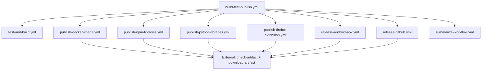

# GitHub Actions Workflows Documentation

This repository contains a comprehensive set of reusable GitHub Actions workflows for building, testing, and publishing various types of applications and libraries.

## 🚀 Quick Start

To use these workflows in your project, create a workflow file in your repository's `.github/workflows/` directory:

```yaml
name: CI/CD Pipeline

on:
  push:
    branches: [ main, develop ]
  pull_request:
    branches: [ main ]

jobs:
  build_and_deploy:
    uses: tehw0lf/workflows/.github/workflows/build-test-publish.yml@main
    with:
      tool: npm
      lint: "run lint"
      test: "run test"
      build_main: "run build"
      artifact_path: "dist"
      docker_meta: '[{"name":"my-app","file":"Dockerfile"}]'
      libraries: "lib1,lib2"
      library_path: "packages"
    secrets: inherit
```

## 📋 Available Workflows

### 1. Universal Workflow (`build-test-publish.yml`)

The main orchestrator workflow that handles the complete CI/CD pipeline.

**Key Features:**
- ✅ Multi-language support (Node.js, Python, Java, Gradle, Bash)
- ✅ Automated testing and building
- ✅ Multi-platform publishing (Docker, npm, PyPI, Firefox, Android)
- ✅ Conditional deployment based on branch and inputs

**Required Inputs:**
- `event_name`: GitHub event name (required)

**Optional Inputs:**
- `tool`: Build tool (npm, yarn, uv, ./gradlew, mvn, bash)
- `lint`: Linting command
- `test`: Test command
- `build_main`: Build command for main branch
- `artifact_path`: Path to build artifacts
- `docker_meta`: Docker metadata JSON
- `libraries`: Comma-separated list of libraries to publish
- And many more...

### 2. Test and Build (`test-and-build.yml`)

Core workflow for testing and building applications.

**Features:**
- ✅ Advanced dependency caching for faster builds
- ✅ Multi-language toolchain setup
- ✅ Nx monorepo support
- ✅ Playwright E2E testing
- ✅ Configurable timeouts (45 minutes)

### 3. Docker Publishing (`publish-docker-image.yml`)

Publishes Docker images to container registries.

**Features:**
- ✅ Multi-platform builds (linux/amd64, linux/arm64)
- ✅ Flexible registry support (GHCR, Docker Hub, private registries)
- ✅ Input validation for security
- ✅ Matrix builds for multiple images
- ✅ Timeout protection (30 minutes)

### 4. NPM Libraries (`publish-npm-libraries.yml`)

Publishes Node.js libraries to npm registry.

**Features:**
- ✅ Version comparison to prevent duplicate publishes
- ✅ Multi-library support
- ✅ Security: Input sanitization and validation
- ✅ Dry-run capability
- ✅ Timeout protection (20 minutes)

### 5. Python Libraries (`publish-python-libraries.yml`)

Publishes Python packages to PyPI using `uv`.

**Features:**
- ✅ UV package manager support
- ✅ Automatic dependency management
- ✅ Timeout protection (15 minutes)

### 6. Firefox Extension (`publish-firefox-extension.yml`)

Publishes Firefox browser extensions to Mozilla Add-ons.

**Features:**
- ✅ Automated packaging (XPI creation)
- ✅ AMO (addons.mozilla.org) publishing
- ✅ Timeout protection (15 minutes)

### 7. Android APK (`release-android-apk.yml`)

Builds and releases Android APK files.

**Features:**
- ✅ Automated keystore generation and caching
- ✅ APK signing and alignment
- ✅ GitHub releases integration
- ✅ Timeout protection (30 minutes)

### 8. GitHub Releases (`release-github.yml`)

Creates GitHub releases with artifacts.

**Features:**
- ✅ Automatic version detection (Python projects)
- ✅ Configurable release tags
- ✅ Artifact attachment
- ✅ Timeout protection (10 minutes)

### 9. Workflow Summary (`summarize-workflow.yml`)

Aggregates and reports results from all publishing workflows.

**Features:**
- ✅ Comprehensive status tracking across all workflows
- ✅ Visual summary table with status indicators
- ✅ Published artifacts tracking and output
- ✅ Quick timeout (5 minutes)

## 🔧 Setup Instructions

### 1. Required Secrets

Add these secrets to your repository settings:

```yaml
# For Docker publishing
GITHUB_TOKEN: # Auto-provided by GitHub

# For npm publishing
NPM_TOKEN: # Your npm access token

# For Python publishing
UV_TOKEN: # Your PyPI token

# For Firefox extensions
AMO_API_KEY: # Mozilla Add-ons API key
AMO_API_SECRET: # Mozilla Add-ons API secret

# For Android builds
ANDROID_STOREPASS: # Android keystore password

# For Nx Cloud (optional)
NX_CLOUD_ACCESS_TOKEN: # Nx Cloud access token
```

### 2. Project Structure Examples

#### Node.js Project
```
project/
├── package.json
├── src/
├── dist/
├── Dockerfile (optional)
└── .github/workflows/ci.yml
```

#### Python Project
```
project/
├── pyproject.toml
├── uv.lock
├── src/
├── dist/
└── .github/workflows/ci.yml
```

#### Monorepo with Libraries
```
project/
├── package.json
├── packages/
│   ├── lib1/package.json
│   └── lib2/package.json
├── apps/
└── nx.json
```

## 🛡️ Security Features

### Enhanced Security
- ✅ Updated to latest action versions (checkout@v5, setup-node@v5)
- ✅ Minimal permissions (contents: read by default)
- ✅ Early secret validation with categorized exit codes

### Input Validation
- ✅ JSON validation for Docker metadata
- ✅ Library name sanitization
- ✅ Path traversal prevention

### Access Control
- ✅ Minimal required permissions
- ✅ Secret-based conditional execution
- ✅ Artifact existence validation

### Timeouts
- ✅ Optimized timeouts (5-60 minutes)
- ✅ Prevents runaway builds
- ✅ Resource usage optimization

## 🚀 Performance Optimizations

### Enhanced Performance
- ✅ Optimized timeouts for faster feedback
- ✅ Conditional Playwright setup (only when needed)
- ✅ Comprehensive workflow summary with status reporting

### Caching Strategy
- ✅ Multi-language dependency caching
- ✅ Build tool caches (npm, pip, gradle, maven)
- ✅ Cross-platform cache keys

### Conditional Execution
- ✅ Branch-based deployment
- ✅ Artifact-dependent publishing
- ✅ Tool-specific optimizations

## 📊 Usage Examples

### Simple Node.js App
```yaml
uses: tehw0lf/workflows/.github/workflows/build-test-publish.yml@main
with:
  tool: npm
  lint: "run lint"
  test: "run test"
  build_main: "run build"
  artifact_path: "dist"
  event_name: ${{ github.event_name }}
```

### Docker + npm Publishing
```yaml
uses: tehw0lf/workflows/.github/workflows/build-test-publish.yml@main
with:
  tool: npm
  build_main: "run build"
  artifact_path: "dist"
  docker_meta: '[{"name":"my-app","file":"Dockerfile"}]'
  docker_namespace: "mycompany"
  registry: "ghcr.io"
  event_name: ${{ github.event_name }}
```

### Python Package
```yaml
uses: tehw0lf/workflows/.github/workflows/build-test-publish.yml@main
with:
  tool: uv
  install: "sync"
  lint: "run lint"
  test: "run test"
  build_main: "build"
  artifact_path: "dist"
  event_name: ${{ github.event_name }}
```

### Bash Scripts
```yaml
uses: tehw0lf/workflows/.github/workflows/build-test-publish.yml@main
with:
  tool: bash
  install: "install.sh"
  lint: "lint.sh"
  test: "test.sh"
  build_main: "build.sh"
  artifact_path: "dist"
  event_name: ${{ github.event_name }}
```

## 🔄 Workflow Dependencies



## 🆘 Troubleshooting

### Common Issues

1. **Build timeouts**: Adjust timeout values in workflow files
2. **Cache misses**: Check cache key patterns and dependencies
3. **Permission errors**: Verify repository secrets and permissions
4. **Artifact not found**: Ensure `artifact_path` is correctly set

### Debug Mode

Enable debug logging by adding this secret:
```yaml
ACTIONS_STEP_DEBUG: true
```

## 📝 Contributing

1. Fork the repository
2. Create a feature branch
3. Make your changes
4. Test with a sample project
5. Submit a pull request

## 📄 License

This workflow collection is available under the MIT License.